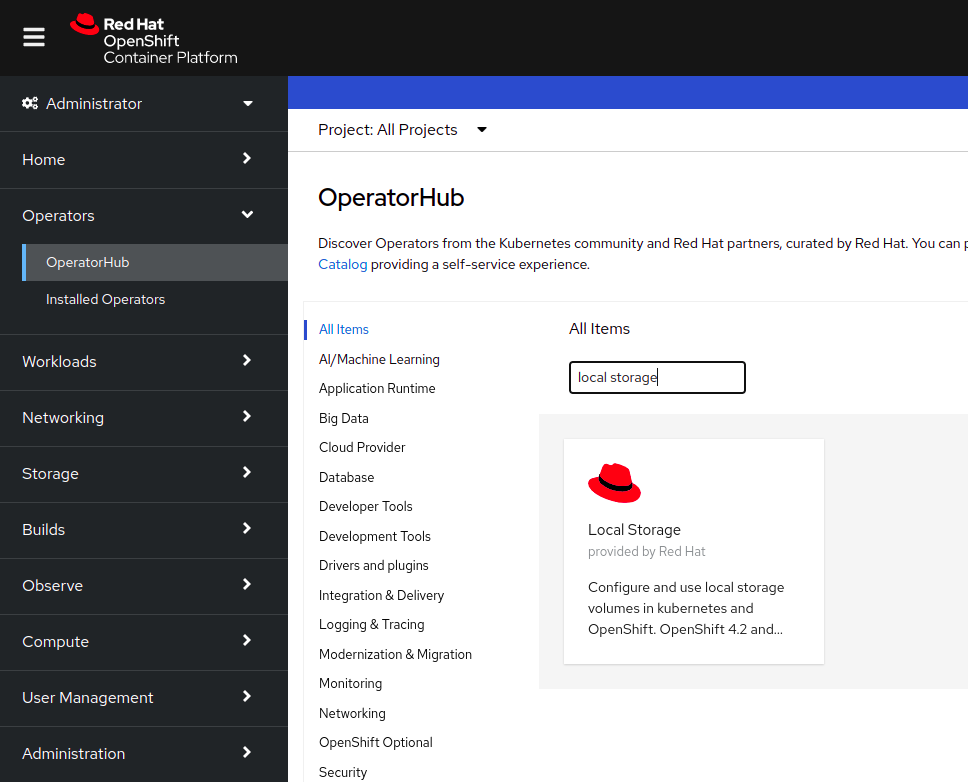
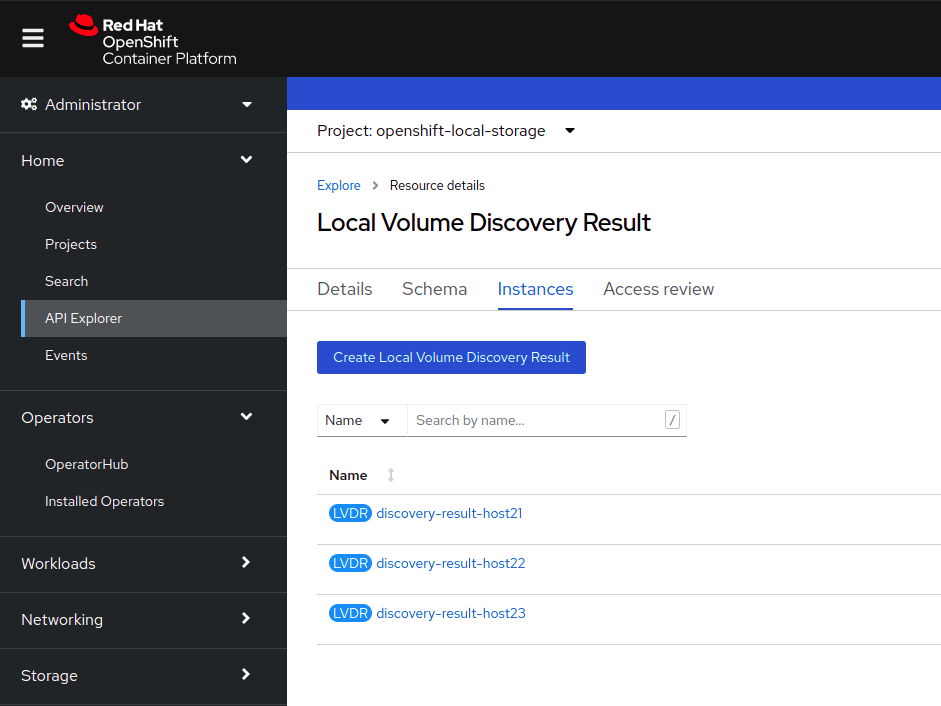
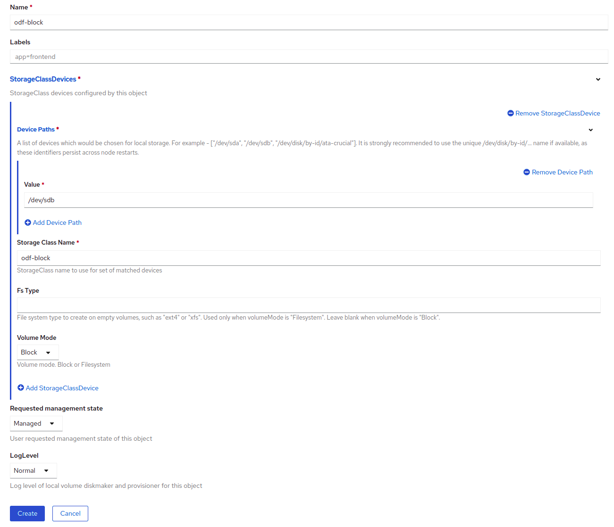

# LSO & ODF Quick Start

This document will describe the installation of the Local Storage Operator (LSO) and OpenShift Data Foundations (ODF).  LSO is a pre-requisite for installing ODF on OpenShift nodes that will use local block devices.

:::{warning}
We’ve found that hugepages needs to be disabled before installing ODF otherwise noobaa pods won’t start correctly. This can be re-enabled afterwards.
:::

1. Install and Configure the Local Storage Operator
    1. From the OCP Web Console go to Operators --> OperatorHub
    2. In the Filter by keyword box type, "Local Storage"
    3. Select "Local Storage" operator

        

    4. Click "Install"
    5. By default, the "openshift-local-storage" namespace will be used. Accept the defaults and click "Install"
    6. After install completes click "View Operator"
    7. Select the "Local Volume Discovery" tab
    8. Click "Create Local Volume Discover"
    9. Under "Node Selector" select the option based on your environment
    10. Click "Create"
    11. After this completes go to Home --> API Explorer
    12. In the search box search for "LocalVolumeDiscoveryResult" and click on the discovered object "LocalVolumeDiscoveryResult"
    13. Select the "Instances" tab

        

    14. Click the first instance name, select YAML tab, and scroll to the bottom of the yaml output. Search for "/dev/sdb" device(our lab device) and make note of the "deviceID". This device should be showed as usable.

        :::{important}
        Using the current device-name will prevent future issues from happening if for some reason the order of the drives change.
        :::

    15. Repeat step 14 for each discovered instance
    16. Go to Operators --> Installed Operators and select "Local Storage" operator
    17. Select the "Local Volume" tab and click "Create Local Volume"
    18. Name the new volume, example "odf-block"
    19. Expand "StorageClassDevice" by clicking the carrot to the right of the section
    20. Expand "Device Paths" again by clicking the carrot to the right of the section
    21. Add all the deviceID's recording in step 14
    22. Name the Storage Class Name, example "odf-block"
    23. Set "Fs Type" = \<blank\>
    24. Set "Volume Mode" = Block
    25. Set "Requested management state" = Managed
    26. Set "LogLevel" = Normal
    27. Click Create

        

2. Install and Configure OpenShift Data Foundation (ODF)
    1. From the OCP Web Console go to Operators --> OperatorHub
    2. In the Filter by keyword box type, "ODF"
    3. Select "OpenShift Data Foundation" operator
    4. Click "Install"
    5. Accept the defaults and click "Install"
    6. After install completes click Operators --> Installed Operators
    7. Select "OpenShift Data Foundation"
    8. Click "Create StorageSystem"
    9. Select "Use an existing StorageClass"
    10. Under StorageClass dropdown select "odf-block"

        :::{note}
        Your name may be different
        :::

    11. Click Next
    12. You should see the total "Available raw capacity" of your selected nodes
    13. Click Next
    14. Leave defaults and click Next
    15. Review the information; if acceptable click "Create StorageSystem"

3. Configure the local Image Registry storage claim
    1. Change project
        ```
        oc project openshift-image-registry
        ```
    2. Patch the image registry config
        ```
        oc patch configs.imageregistry.operator.openshift.io cluster --type merge --patch '{"spec":{"managementState":"Managed"}}'
        ```
    3. Set the storage class "ocs-storagecluster-cephfs" as default
        ```
        oc patch storageclass ocs-storagecluster-cephfs -p '{"metadata": {"annotations": {"storageclass.kubernetes.io/is-default-class": "true"}}}'
        ```    
    4. Verify storage class default
        ```
        oc get sc
        ```
   5. Add PVC claim by editing the config
        ```
        oc edit configs.imageregistry.operator.openshift.io
        
        # Replace the "storage: {}" line with the following
        #
        # storage:
        #   pvc:
        #     claim:
        ```
   6. Check pvc STATUS = "Bound"
        ```
        oc get pvc
        ```

4. Local registry quick start
    1. Set the defaultRoute to true:
        ```
        oc patch configs.imageregistry.operator.openshift.io/cluster --patch '{"spec":{"defaultRoute":true}}' --type=merge
        ```
    2. Get the default registry route:
        ```
        HOST=$(oc get route default-route -n openshift-image-registry --template='{{ .spec.host }}')
        ```
    3. Enable the cluster’s default certificate to trust the route using the following commands:
        ```
        oc get secret -n openshift-ingress  router-certs-default -o go-template='{{index .data "tls.crt"}}' | base64 -d | sudo tee /etc/pki/ca-trust/source/anchors/${HOST}.crt  > /dev/null
        ```
    4. Enable the cluster’s default certificate to trust the route using the following commands:
        ```
        sudo update-ca-trust enable
        ```
    5. Log in with podman using the default route:
        ```
        sudo podman login -u kubeadmin -p $(oc whoami -t) $HOST
        ```
